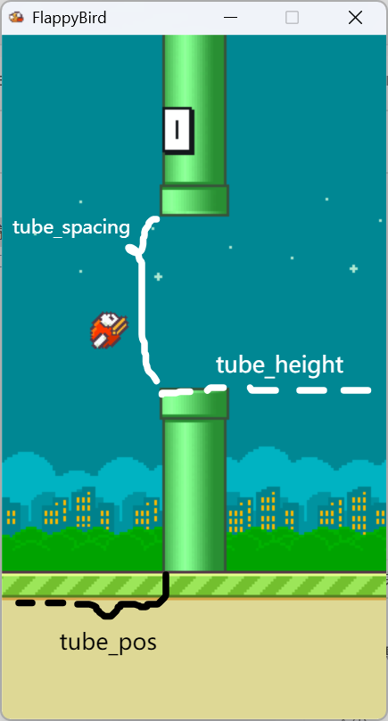

这是在开始开发前编写的**项目规划**与**项目框架文档**。

# 项目规划

## Checkpoint 1 ~第一周 | 完成 VGA 串口相关的基础工作

- [x] 完成 Lab8 Part 1 要求的内容，将屏幕点亮，播放视频，封装好绘制部分的接口。

- [x] 写完开发文档的大部分内容，其中各种数的表示方式、硬件模块功能等需要确定下来。
- [x] （如果有时间的话）做出玩家交互（用 btn）和基础的玩家绘制模块，不考虑玩家的帧动画和旋转。

## Checkpoint 2 ~第二周 | 做出一个最低限度的，可以游玩的游戏版本

- [x] 完成随机数发生器、计时器、计分器等基础设施。

- [x] 完成系统节点、玩家交互、管道计算、碰撞检测、玩家/管道绘制的硬件节点。绘制部分不需要考虑美观性，也不必完成动画，只需要将物品摆放在正确的位置即可。
- [x] 无需绘制背景和分数。
- [x] 游戏开始和失败时暂停即可，不需做出动画和 GUI。
- [x] 玩家的控制仍然用 btn 就好，暂时不需要写键盘交互。分数可以显示在数码管上，也可以不显示。
- [x] 管道可以均匀地分布，不需要随着分数增加越来越近、越来越窄，但需要为这个后续设计留好硬件接口。

## Checkpoint 3 ~第三周 | 完成所有游戏内容

- [x] 贴上所有的美术素材，包括玩家的帧动画与旋转贴图，背景贴图，随背景移动的地面。每一轮游戏中玩家和背景会随机选取。游戏开始前的界面玩家的帧动画也会正常播放。
- [x] 完成 GUI。这包括分数显示、开始游戏时的 READY、游戏结束时淡入的 GAME OVER。
- [ ] 优化管道的分布，随着分数增加逐渐变密、变窄，但到达一个临界时就不再变化。这需要设计一个小函数。
- [ ] 试着做一做键盘的交互，但这不重要。

## Checkpoint 4 ~如果提前做完了 | 选择性的锦上添花

- [ ] 优化游戏结束时的 GUI，显示奖牌和最高分。
- [ ] 写一写音频接口，加上一些音乐音效。
- [ ] 做一些好玩的特效，塞一些好玩的私货进去。
- [ ] 我想做成双人游戏！两边屏幕同时进行游戏。
- [ ] ......（还能想到什么就往这里加吧！）

希望能够顺利完成！

# 开发文档

## 基本概念

- 帧、主循环：游戏状Q态机以 1 帧作为一次时钟周期（而不是硬件时钟周期）。我希望将游戏做成 60 帧的。这样每帧大概能等待 $100\text{MHz} \times \frac{1}{60}\text{s}=166666$ 个硬件时钟周期。每一帧称为一次主循环/Update 事件。一次主循环中需要做以下事情：

  初始化：

  - 更新全局时钟、移动像素数和玩家分数，初始化所有可能的状态机。

  计算：

  - 计算可能显示在屏幕中的管道的位置、高度、宽窄信息。其中对可能和玩家发生碰撞的管道（只会有一根）需要特别处理。
  - 接受输入，结合重力的影响，更新玩家的位置和速度。
  - 检测一次玩家和管道的碰撞，更新游戏状态。

  绘制：

  - 绘制背景；根据移动像素数，绘制移动地面；
  - 根据前面已经保存至寄存器的管道信息、玩家位置速度，绘制出玩家、管道；
  - 根据游戏状态，绘制 GUI。
  - 更新屏幕显示的信息。

  具体的实现方案会在后文解释。

- 32 bit 定点小数：因为游戏本体只需处理对小数的加减运算，因此我的想法是用整数去达到小数的效果。即：一个 32 bit 整数 $A$ 实际上表示的是 $A\times 2^{-16}$，在需要约化成整数时直接取前 16 位处理。

  鸟的速度和高度采用这个方式存储。我不确定这个是不是一个好想法（）

- 游戏屏幕大小为 800$\times$600。我之前做的版本是 288$\times$512 的。游戏屏幕可能需要裁剪，但是在 Checkpoint 2阶段我们不需要管这个。

  我不确定开发板是以左上角还是左下角为屏幕原点。

- 屏幕坐标：绘制在屏幕上的像素点的位置。

  世界坐标：游戏开始前鸟的位置为横坐标 0 像素；地面的高度为 0 像素；纵坐标从屏幕下方到上方逐渐增加。

- 颜色混合：若想把颜色 $(R_1,G_1,B_1,A_1)$ 绘制在 $(R,G,B)$ 颜色的背景上。

  这里假设色彩分量的取值是 $[0,1]$。如果是 $[0,255]$ 就将分量除以 $255$。

  绘制得到的新色彩为 $(A_1R_1+(1-A_1)R,A_1G_1+(1-A_1)G,A_1B_1+(1-A_1)B)$。

  也就是说，透明度 $A_1$ 起到的是一个线性组合参数的作用。

## 共享数据

这些数据可以放在一个共享的寄存器堆里，也可以直接从计算这些数据的模块接出。我更倾向后者，因为这些数据实际上不多。

### 常数

- `SCREEN_WIDTH=800, SCREEN_HEIGHT=600` 屏幕尺寸。单位像素。
- `FPS=60` 帧率。每秒 60 帧。
- `GAME_WIDTH, GAME_HEIGHT` 游戏画面尺寸。单位像素。待定。
- `MAX_HEIGHT` 世界坐标的最高高度，即从地面上方到游戏画面最顶部的距离。待定。
- `BIRD_WIDTH, BIRD_HEIGHT` 鸟的碰撞箱的尺寸。单位像素。待定。
- `TUBE_WIDTH` 管道碰撞箱的宽度。单位像素。待定。
- `N_TUBE=4` 屏幕中显示的最多的管道数。
- `IND_TUBE_INTERACT=1` 屏幕管道列表中唯一可能与玩家发生碰撞的管道的下标。 
- `BIRD_HSPEED` 鸟飞行的水平速度。（实际上也是背景移动的速度）。单位像素/帧。待定。
- `GRAVITY` 重力加速度。单位像素/帧$^2$。用 32bit 定点小数储存。为负数。待定。
- `BIRD_JUMP_VELOCITY` 按下按钮后鸟的竖直速度会被重置为这个值。单位像素/帧。用 32bit 定点小数储存。待定。
- `BIRD_ANIMATION_SPEED` 更新一次玩家翅膀动画所等待的帧数。

### 每轮游戏需要更新的数据

- `reg[15:0] world_seed`  生成每轮游戏中所有随机信息所用的随机数种子。加载游戏时更新。一个 16 bit 随机数，可以是真随机数，也可以根据加载游戏的时间确定。`world_seed[15]` 代表关卡背景（0=白天, 1=夜晚），`world_seed[14:13]` 代表鸟的颜色（00, 01=黄，10=蓝，11=红），`world_seed[12:0]` 会在管道生成模块中用作伪随机数种子。【Checkpoint 2】

  可以考虑用一个 IP 核生成。

- `reg[15:0] high_score` 最高分。结束游戏时更新。【Checkpoint 4】

### 每帧需要更新的数据

- `reg[1:0] game_status` 游戏状态机。在 StatusUpdate 模块更新。00=重置游戏（在这一状态初始化游戏后马上置为 01 状态，不必停留一帧），01=“READY”界面，10=游戏进行中，11=“GAME OVER”界面。【Checkpoint 2】

- `reg[15:0] score` 游戏分数。在 StatusUpdate 模块更新，在玩家完全通过一根管道后自增 1。虽然不急着显示但是需要做出来。【Checkpoint 2】

- `reg[31:0] bird_x` 鸟的世界坐标横坐标（像素）。每帧自增 `BIRD_HSPEED` 即可。【Checkpoint 2】

- `reg[2:0] p1_input`  玩家 1 的键盘输入。以”帧“而不是“硬件时钟”为单位更新。因为 Flappy Bird 只用一个键就能玩，所以这里只需要一个寄存器。`p1_input[0]` 表示这一帧是否刚按下按钮（上一帧未按下，”Pressed“）；`p1_input[1]` 表示这一帧按钮是否在按住的状态（和上一帧是否按下无关）；`p1_input[2]` 表示这一帧按钮是否刚松开（上一帧按下，这一帧未按下，“Released”）。

  实际上我们只需要 `p1_input[0]` 就可以做到游戏本体能做的所有事情。不过为了方便以后可能的增量，就把这些都做出来吧。

  先实现一个输入模块，把板子上的按钮封装一下。【Checkpoint 1】

  有时间再改成封装键盘。【Checkpoint 3】

- `reg[31:0] tube_pos[N_TUBE-1:0]` 下半管道左上角世界坐标的横坐标。

  `reg[15:0] tube_height[N_TUBE-1:0]` 下半管道左上角世界坐标的纵坐标。

  `reg[7:0] tube_spacing[N_TUBE-1:0]` 存储上下管道的间距。（像素）。

  管道参数。这三个都是数组。数组的宽度 `N_TUBE` 为参数，表示参与绘制的管道数目（即会显示在屏幕上的管道数目）。暂时把这一参数定为 4，若发现不足，希望能够方便地修改。

  特别地，规定这三个数组中下标为 `IND_TUBE_INTERACT` （参数，暂定为 1）的管道表示可能与玩家发生碰撞的管道。碰撞检测时只有这一管道参与计算。

  在玩家不再会与 `IND_TUBE_INTERACT` 发生碰撞时（这时游戏分数也会更新），管道数组整体左移一次，包括将 `IND_TUBE_INTERACT + 1 ` 下标存储的管道移至 `IND_TUBE_INTERACT` 下标存储的管道中。这一步并不需要实际的操作，用当前的分数计算显示在屏幕上的 `N_TUBE` 根管道对应的下标，用于计算即可。

  每一帧，负责管道计算的模块调用伪随机模块，将管道的下标（游戏中的管道编号，而不是屏幕上的管道编号）、`world_seed[12:0]` 这两个值一起送入一个伪随机数发生器，计算出 `tube_height`；将管道下标送入一个映射函数模块，计算出 `tube_pos` 和 `tube_spacing` ，以达到分数越高管道越密越难的效果。Checkpoint 1 阶段函数只需要线性映射或者映射为常数即可。【Checkpoint 2】

  Checkpoint 3 需要完善管道密度的映射。【Checkpoint 3】

  

- `reg[31:0] p1_bird_y` 玩家 1 的鸟的高度（像素）。用 32bit 定点小数存储。鸟的原点设置在左上角，避免一些偏移之类的问题。

  `reg[31:0] p1_bird_velocity` 玩家 1 的鸟的竖直速度（像素/帧）。用 32bit 定点小数存储。

  用以下方法更新这两个寄存器的状态：

  如果鸟高度的整数部分没有到达 `MAX_HEIGHT` ，则检查 `p1_input[0]` 。如果值为 1，则将 `p1_bird_velocity` 更新为 `BIRD_JUMP_VELOCITY`；如果值为 0，则将 `p1_bird_velocity` 更新为 `p1_bird_velocity + GRAVITY`。如果鸟已经到达最高高度，则将 `p1_bird_velocity` 更新为 `GRAVITY`。更新方式可以用时序状态机之类的逻辑。

  再将得到的新速度加在 `p1_bird_y` 上。若更新后 `p1_bird_y` 高于 `MAX_HEIGHT`，则将其设置为 `MAX_HEIGHT`。

  这样就完成了鸟的操作逻辑。【Checkpoint 2】

- `reg[16:0] bg_xshift` 背景地板移动的距离。也是每帧自增 `BIRD_HSPEED`，与 `bird_x` 的区别在于这是一个循环计数器。【Checkpoint 3】

  `reg[1:0] bird_animation` 玩家播放扑腾翅膀动画的帧编号。为一个模 3 计数器，每 `BIRD_ANIMATION_SPEED` 帧自增 1。【Checkpoint 3】

  以及其他我还没想好的和动画相关的变量。【Checkpoint 3】

## 模块设计

我相信做完这些模块之后游戏就能成功运行起来，大概。感觉我的描述还没有很详细具体（）

带 [*] 的元件为例化了大量子模块的元件。

### [*] Top

输入：`clk`, `rst`, `btn`

输出：VGA 显示之类的信号，或许还有数码管？

例化 FrameClock, WorldData, CalcCore, ViewCore 元件。向它们发送硬件时钟信号。

如果检测到 FrameClock 输出了 `game_rst`，就重置一次 WorldData CalcCore, ViewCore 元件。

整理 WorldData, CalcCore 等元件发送的 finish 信号，如果这些元件都完成了计算再为 FrameClock 的 `en` 设置为 1，表明可以发送 Update 事件信号。

### FrameClock

输入：`clk`, `rst`, `en`

输出：`upd`, `game_rst`

可仿真波形测试。

【Checkpoint 2】

为一个时钟，每计时一帧就不断检测 `en`（表示计算是否完成），若为 `1` 则向所有需要更新的模块发送一个硬件时序的更新信号 `upd`。

特别地，如果检测到 `game_status == 00`，就立即发送一次重置信号 `game_rst`。

### WorldData

输入：`clk`, `rst`

输出：`world_seed[15:0]`， `finish`

可仿真波形测试。

【Checkpoint 2】

#### Reset 事件：

每重置一次就随机更改输出变量 `world_seed[15:0]`。

### [*] CalcCore

输入：`clk`, `rst`, `upd` 等等

输出：`finish`

【Checkpoint 1】

在模块中例化 KeyInput, GlobalDataUpdate，TubeUpdate，BirdUpdate，StatusUpdate 模块。

#### Reset 事件：

向所有计算元件发送 rst 信号。直到所有元件重置完毕再将 `finish` 置为 1。

#### Update 事件：

接收到 `upd` 信号后将 `finish` 置为 0，并向 KeyInput 和 GlobalDataUpdate 发送一个 upd 信号。在这两者都计算完后再向 TubeUpdate 和 BirdUpdate 发送 upd 信号；等这两个都计算完后再向 StatusUpdate 发送 upd 信号。在 StatusUpdate 计算完后将 `finish` 置为 1。

### KeyInput

【Checkpoint 2】

输入：`clk`, `rst`, `upd`, `btn`

输出：`p1_input[2:0]`, `finish`

#### Reset 事件：

将 `p1_input[2:0]` 设置为 `3’b0`。将 `finish` 置为 1.

#### Update 事件：

按文档的描述检测按钮的按下状态并输出。

### GlobalDataUpdate

输入：`clk`, `rst`, `upd`

输出：`finish`

【Checkpoint 3】

暂时不做任何事情。`finish` 始终置为 1。如果想到了什么再在这里写东西。

### TubeUpdate

输入：`clk`, `rst`, `upd`, `seed[12:0]`, `score[15:0]`

输出：`finish`, `reg[31:0] tube_pos[N_TUBE-1:0]`, `reg[15:0] tube_height[N_TUBE-1:0]` , `reg[7:0] tube_spacing[N_TUBE-1:0]`

【Checkpoint 2】

#### Reset 事件：

将输出的变量全部设置为一系列不会使得绘制元件出错的默认值。（如`tube_pos` 设置到屏幕外）将 `finish` 置为 1.

#### Update 事件：

先将 `finish` 设置为 0.

按照上面的描述更新这些变量即可。更新完后将 `finish` 设置为 1。

需要伪随机数计算器和 `height` 映射、`spacing` 映射三个子模块。

可以设计成组合的或者时序的。组合的需要例化 `N_TUBE` 组伪随机数计算器和映射器。时序的只需要例化一组。为了简洁起见可以先设计成组合的。

### BirdUpdate

输入：`clk`, `rst`, `upd`, `p1_input[2:0]`, `game_status[1:0]`

输出：`finish`, `bird_x[31:0]`, `p1_bird_y[31:0]` , `p1_bird_velocity[31:0]`

【Checkpoint 2】

#### Reset 事件：

将 `bird_x`, `p1_bird_velocity` 置为 0。将 `p1_bird_y` 设置为一个显示在屏幕上的合适高度。将 `finish` 设置为 1.

#### Update 事件：

##### 游戏状态为 01（READY）

【Checkpoint2】什么也不做。

【Checkpoint3】让鸟上下摆动。即设置 `p1_bird_y`。

##### 游戏状态为 10（INGAME）

按照上面的描述，根据输入更新变量值。我想应该需要用一个状态机实现。

##### 游戏状态为 11（GAMEOVER）

什么也不做。

### StatusUpdate

输入：`clk`, `rst`, `upd`, `p1_input[2:0]`,  `tube_pos[31:0]`, `tube_height[15:0]` , `tube_spacing[7:0]`, `bird_x[31:0]`, `p1_bird_y[31:0]`（只需输入下标为 `IND_TUBE_INTERACT` 的管道信息即可）

输出：`finish`, `score[15:0]`, `game_status[1:0]`

【Checkpoint 2】

例化一个 CollisionCheck 组合模块。将管道信息和玩家坐标的整数部分输入至子模块中。

#### Reset 事件：

将 `score` 置为 0，将 `game_status` 置为 01，将 `finish` 置为 1.

#### Update 事件：

如果 `game_status == 0’b11` 且 `p1_input[0]==1`，则将 `game_status` 置为 00，即在下一帧做一次初始化。绘制元件对于 `game_status` 在 00 和 11 的行为应该是一致的，都绘制 GAMEOVER 的 UI。（我觉得这些其实不应该写在名为

如果 `game_status == 0’b10` ：

- CollisionCheck 子模块检测到了碰撞，则将 `game_status` 置为 11。
- CollisionCheck 子模块检测到了玩家成功通过一个管道，则将 `score` 自增 1。

### CollisionCheck

输入： `tube_pos[31:0]`, `tube_height[15:0]`, `tube_spacing[7:0]`, `bird_x[31:0]`, `p1_bird_y[15:0]`

输出：`collide`, `passed`

【Checkpoint 2】

这是一个组合元件。

用比较器判断玩家是否与 `IND_TUBE_INTERACT` 管道发生碰撞或是否越过该管道。

### [*] ViewCore

输入：

- 硬件数据及帧数据`clk`, `rst`, `upd`
- 世界随机数 `world_seed[15:13]`
- 游戏状态数据 `game_status[1:0]`
- 待绘制的管道数据 `reg[31:0] tube_pos[N_TUBE-1:0]`, `reg[15:0] tube_height[N_TUBE-1:0]` , `reg[7:0] tube_spacing[N_TUBE-1:0]`
- 鸟相关的数据 `bird_x[31:0]`, `p1_bird_y[31:0]` , `p1_bird_velocity[31:0]`

输出：`finish`, 可被 VGA 串口接受的数据

【Checkpoint 2】

例化一系列 ROM、屏幕坐标计算及绘制元件。

大致是根据世界随机数及输入数据确定背景、鸟的屏幕坐标、图像编号，确定鸟的 BRAM；确定管道的屏幕坐标，确定每条管道的 BRAM；更新 `bg_xshift` 等数据，确定滚动的地面背景的 BRAM。

然后将这些数据绘制在屏幕上。

我还没有完全看明白我该怎么实现。这里的子模块描述暂时还没写完。