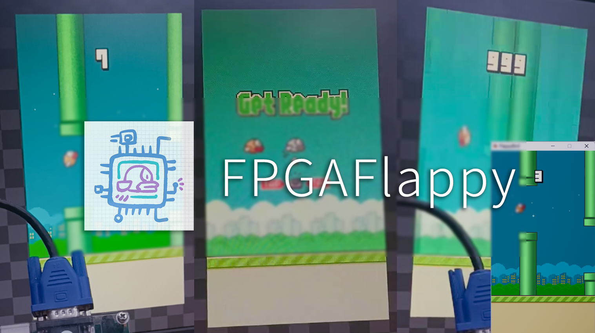
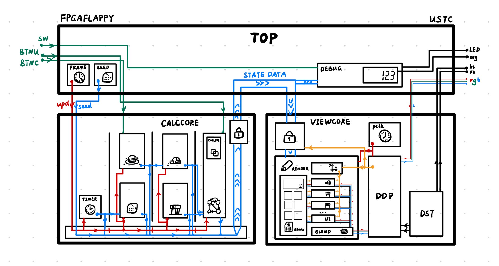

# FPGAFlappy

在 FPGA 上实现一个 Flappy Bird！

---

这是我们在中国科学技术大学 2024 年《模拟与数字电路实验》课程 Lab 8 的实验作业。

实验链接：[实验介绍 - Digital Lab 2024](https://soc.ustc.edu.cn/Digital/2024/lab8/intro/)   我们选取了分值最高的 VGA 小游戏。

@tinatanhy 上传的演示视频：https://www.bilibili.com/video/BV1w6CNYPEak

@rubatotree 的开发 blog：[用 FPGA 写 Flappy Bird！ - Umbrella Coffee Blog by rubatotree](http://blog.umb-coffee.icu/2024/fpga-flappy/) 含有对框架设计及具体实现的详细说明。

---

## 项目框架

下图是本项目的框架简图。更具体的介绍见 blog。

## 配置说明

我们全程使用 Vivado 2023.1 作为 IDE，在 Windows 上调试运行。使用的开发板型号为 `100tcsg324-1`。

我们自己编写的代码全部为 Verilog 语言，不涉及 System Verilog 等。

`projects/Flappy` 下同步的文件应当已经包含综合实现所需要的所有信息，在拉取仓库后直接打开 Flappy.xpr 即可尝试综合实现并烧板运行。

## 其他文件

`assets/` 存储本文档引用的图片。

`bitstreams/` 存储为 100tcsg324-1 开发板烧写的 Bitstream，可以直接烧板运行游戏。

`example/` 是我以前用 Gamemaker 8 复刻的 Flappy Bird 小游戏及其工程。本项目参考这个工程实现。

`game_assets/` 是本项目用到的游戏素材、转换后的 coe 文件及转换脚本。我们没有这些素材的版权。

`projects/` 为本项目的工程文件。

`slides.pdf` 为本项目最终答辩的 Slides。

`Dev.md` 为在开始开发前为该项目编写的说明文档。 

