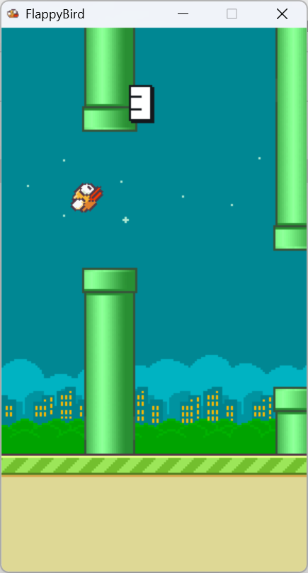

# FPGA_Flappy

在 FPGA 上实现一个 Flappy Bird！

## 项目说明

Markdown 编辑时请设置图片默认存储路径为当前文件夹下的 `assets` 文件夹里。

## 项目规划

### Checkpoint 1 ~第一周 | 完成 VGA 串口相关的基础工作

- [ ] 完成 Lab8 Part 1 要求的内容，将屏幕点亮，播放视频，封装好绘制部分的接口。

- [ ] 写完开发文档的大部分内容，其中各种数的表示方式、硬件模块功能等需要确定下来。
- [ ] （如果有时间的话）做出玩家交互（用 btn）和基础的玩家绘制模块，不考虑玩家的帧动画和旋转。

### Checkpoint 2 ~第二周 | 做出一个最低限度的，可以游玩的游戏版本

- [ ] 完成随机数发生器、计时器、计分器等基础设施。

- [ ] 完成系统节点、玩家交互、管道计算、碰撞检测、玩家/管道绘制的硬件节点。绘制部分不需要考虑美观性，也不必完成动画，只需要将物品摆放在正确的位置即可。
- [ ] 无需绘制背景和分数。
- [ ] 游戏开始和失败时暂停即可，不需做出动画和 GUI。
- [ ] 玩家的控制仍然用 btn 就好，暂时不需要写键盘交互。分数可以显示在数码管上，也可以不显示。
- [ ] 管道可以均匀地分布，不需要随着分数增加越来越近、越来越窄，但需要为这个后续设计留好硬件接口。

### Checkpoint 3 ~第三周 | 完成所有游戏内容

- [ ] 贴上所有的美术素材，包括玩家的帧动画与旋转贴图，背景贴图，随背景移动的地面。每一轮游戏中玩家和背景会随机选取。游戏开始前的界面玩家的帧动画也会正常播放。
- [ ] 完成 GUI。这包括分数显示、开始游戏时的 READY、游戏结束时淡入的 GAME OVER。
- [ ] 优化管道的分布，随着分数增加逐渐变密、变窄，但到达一个临界时就不再变化。这需要设计一个小函数。
- [ ] 试着做一做键盘的交互，但这不重要。

### Checkpoint 4 ~如果提前做完了 | 选择性的锦上添花

- [ ] 优化游戏结束时的 GUI，显示奖牌和最高分。
- [ ] 写一写音频接口，加上一些音乐音效。
- [ ] 做一些好玩的特效，塞一些好玩的私货进去。
- [ ] 我想做成双人游戏！两边屏幕同时进行游戏。
- [ ] ......（还能想到什么就往这里加吧！）

希望能够顺利完成！