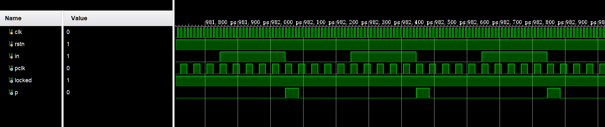

（因为我习惯边写实验边写报告，所以开了这么个md）

## Part 1 VGA 显示

### 下降沿检测模块 PS 的编写

因为考虑到要在下降沿立即响应，且 pclk 的频率较小，预测毛刺较少，因此这里只使用了二级寄存器的边沿检测。

```verilog
module PS#(
	parameter  WIDTH = 1
) (
	input             s,
	input             clk,
	output            p
);

// 二级寄存器。可能存在时序问题，从而要使用三级寄存器？
reg sig_r1, sig_r2;
initial begin
    sig_r1 = 1'b0;
    sig_r2 = 1'b0;
end

always @(posedge clk) begin
    sig_r1 <= s;
    sig_r2 <= sig_r1;
end

assign p = ~sig_r1 & sig_r2;
endmodule
```

因为检测的是 pclk 的信号，在 Testbench 里也例化了一个分频 ip 核。

```verilog
module PS_tb();

reg clk, rstn;
reg in;
initial begin
    clk = 0;
    in = 0;
    rstn = 0;
    #10;
    rstn = 1;
    forever #5 clk = ~clk;
end

initial begin
    #45;
    forever #200 in = ~in;
end

wire pclk, locked;

ClkWizPCLK clkwiz_pclk
(
    // Clock out ports
    .clk_out1(pclk),     // output clk_out1
    // Status and control signals
    .resetn(rstn), // input reset
    .locked(locked),       // output locked
    // Clock in ports
    .clk_in1(clk)      // input clk_in1
);

wire p;
PS #(1) ps(
    .s      (in),
    .clk    (pclk),
    .p      (p)
);

endmodule

```

测试仿真波形如下：

